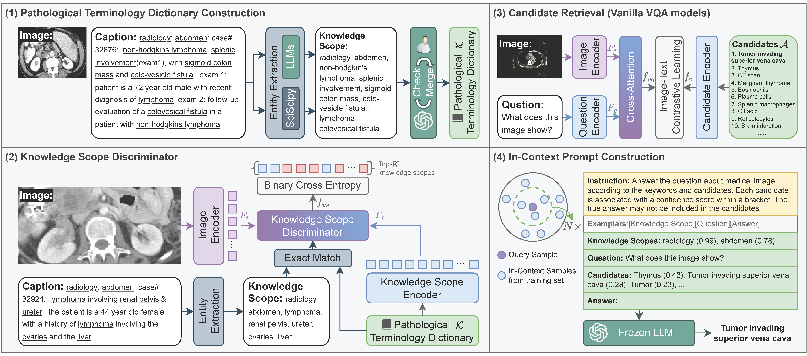

<div align="center">
  
# Candidate-Heuristic In-Context Learning: A New Framework for Enhancing MedVQA with Large Language Models

</div>

## 💡Overview
CH-ICL is a candidate-heuristic framework, which transforms images into text using just a few trainable parameters and leverages the contextual understanding capability of LLMs to enhance the performance of existing medical VQA models. The proposed method is plug-and-play, and its effectiveness has been demonstrated on three existing medical VQA datasets.



## 📔Pathology Terminology Dictionary

The keywords of our dataset images are widely diverse, including various image types, systems and organs, diseases,
symptoms, staining techniques, etc.


## 🔨Setup

### Requirement
```
conda create -n chicl python=3.8
conda activate chicl
pip install -r requirements.txt
```

### 🔨Pre-trained weights(Optional)
Download BiomedCLIP and place it in `./src/backbone/BiomedCLIP`.

BiomedCLIP links:
+ [Huggingface](https://huggingface.co/microsoft/BiomedCLIP-PubMedBERT_256-vit_base_patch16_224)
+ [Baiduyun](https://pan.baidu.com/s/1OTS2i14qAoXdZfvkkyh86Q?pwd=6666)

**Note**: Directly downloading weights from Huggingface might encounter network issues. To facilitate modifications, we have converted the original `.bin` file to PyTorch's `.pth`. We recommend using the Baiduyun version.


### 📑Data Preparation
Our data mainly comes from publicly available, free online Pathology Education Informational Resource ([PEIR](https://peir.path.uab.edu/library/index.php?/category/2)) Digital Library. 
We test our model on:
+ [VQA-RAD](https://osf.io/89kps/)
+ [SLAKE](https://www.med-vqa.com/slake/)
+ [PathVQA](https://github.com/UCSD-AI4H/PathVQA)


### Prepare BiomedCLIP Pre-extracted Image Feature
Note: We recommend using our pre-extracted BioMedCLIP features. The original images can also be found in the links below:

| Dataset  | Pre-extracted Features  & Original Images |
|----------|------------------------------------------|
| PEIR     | [Baiduyun, Rename zzz2zip](https://pan.baidu.com/s/1sJp_3UzjIIvOiuyMB417GQ?pwd=6666)|
| PEIR BioMedCLIP features & keyword & GPT3.5 rewrite caption | [Baiduyun](https://pan.baidu.com/s/1pqHhrxLL-ZdgEat0wNwLmQ?pwd=6666)|
| PathVQA  | [Baiduyun](https://pan.baidu.com/s/1b1SuDSbsNM1rVGzbx8utvg?pwd=6666)|
| Slake    | [Baiduyun](https://pan.baidu.com/s/1mfAoi9_HZkrk7OuyQIn4-w?pwd=6666)|
| RADVQA   | [Baiduyun](https://pan.baidu.com/s/1gBjAjq2L-iIMf0j05QsJ-w?pwd=6666)|


### Training and Validation:
Below are the pre-trained keyword and VQA weights:
+ [PEIR(keyword)](https://pan.baidu.com/s/1pM6CJMAz2SaAvphZ6vjU-w?pwd=6666)
+ [VQA models](https://pan.baidu.com/s/1u3wDTBqokg_x1hrk5J62VA?pwd=6666)


For PathVQA, as an example:
- Download the features and place them in `./data/PathVQA`.
Execute:
```bash
python3 src/trainval.py \
        --dataset 'pathvqa' \
        --data_path './data/Annotations/PathVQA' \
        --feature_path './data/PathVQA'\
        --batch_size 128 \
        --freeze \
        --d_input 768 \
        --method 'biomed'
```

### Testing
(You need to run test.py and test_peir.py separately to generate topk candidate and topk keyword), see `test.sh`:

```bash
python3 src/test.py \
        --dataset 'pathvqa' \
        --data_path './data/Annotations/PathVQA' \
        --feature_path './data/PathVQA'\
        --batch_size 128 \
        --visible \
        --method 'biomed' \
        --checkpoint 'your_checkpoint_path.pth'

python3 src/test_peir.py \
        --dataset 'pathvqa' \
        --data_path './data/Annotations/PathVQA' \
        --feature_path './data/PathVQA'\
        --batch_size 32 \
        --visible \
        --method 'biomed' \
        --checkpoint './checkpoints/peir/biomed_freeze/ckpt_best_model.pth'

```

The results `pathvqa_results.json` and `pathvqa_keyword_results.json` will be saved in the project's root directory.

Then replace the keyword and vqa result json path in `tools/openai_api_test_keyword.py`.
Execute:

```
python3 tools/openai_api_test_keyword.py

```

## 📝Acknowledgements
We also reference the excellent repos of [BioMedCLIP](https://huggingface.co/microsoft/BiomedCLIP-PubMedBERT_256-vit_base_patch16_224), [PubMedCLIP](https://github.com/sarahESL/PubMedCLIP), in addition to other specific repos to the baselines we examined (see paper).

## 📝Citation
If you find this paper useful, please consider staring 🌟 this repo and citing 📑 our paper:
```
@article{Liang2024CandidateHeuristicIL,
  title={Candidate-Heuristic In-Context Learning: A new framework for enhancing medical visual question answering with LLMs},
  author={Xiao Liang and Di Wang and Haodi Zhong and Quan Wang and Ronghan Li and Rui Jia and Bo Wan},
  journal={Inf. Process. Manag.},
  year={2024},
  volume={61},
  pages={103805},
  url={https://api.semanticscholar.org/CorpusID:270671790}
}
```
