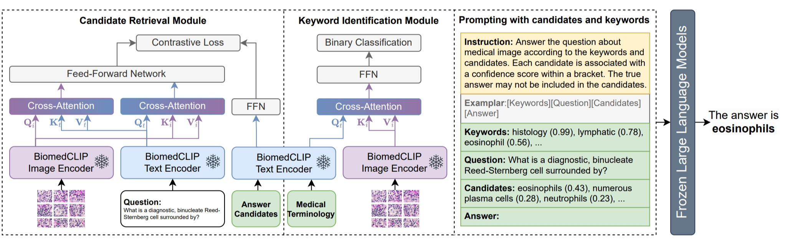
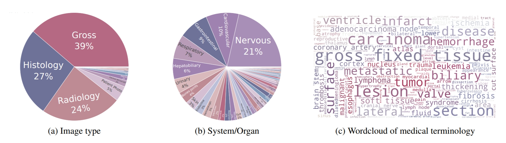

# Candidate-Heuristic In-Context Learning: A New Framework for Enhancing MedVQA with Large Language Models

## 💡Overview
CH-ICL is a simple yet effective visual question answering framework, which transforms images into text using just a few trainable parameters and leverages the contextual understanding capability of LLMs to enhance the performance of existing medical VQA models. The proposed method is plug-and-play, and its effectiveness has been demonstrated on three existing medical VQA datasets.



## 📔Keywords

The keywords of our dataset images are widely diverse, including various image types, systems and organs, diseases,
symptoms, staining techniques, etc.




## 🔨Setup

### Requirement
```
conda create -n chicl python=
conda activate sevila
pip install -r requirements.txt
```

### 📑Data Preparation
Our data mainly comes from publicly available, free online Pathology Education Informational Resource ([PEIR](https://peir.path.uab.edu/library/index.php?/category/2)) Digital Library. 
We test our model on:
+ [VQA-RAD](https://osf.io/89kps/)
+ [SLAKE](https://www.med-vqa.com/slake/)
+ [PathVQA](https://github.com/UCSD-AI4H/PathVQA)

## 📝Citation

If you find this paper useful, please consider staring 🌟 this repo and citing 📑 our paper:
```

```
